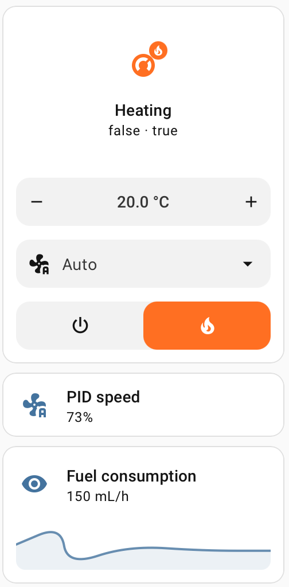

# Rixens Integration for Home Assistant

[](https://github.com/crbn60/ha-rixens-integration/actions/workflows/validate.yml)
[](https://github.com/hacs/integration)
[](https://github.com/crbn60/ha-rixens-integration/releases)
[](https://github.com/crbn60/ha-rixens-integration/issues)

Control your Rixens heating system from your phone, tablet, or any Home
Assistant dashboard. Set temperatures, switch between heat sources, and get
alerts — all without walking to the thermostat.



## What You Need

- A **Rixens heating system** connected to your local WiFi network (a beta
  firmware may be required)
- **Home Assistant** (2023.1 or later)
- **HACS** installed
  ([how to install HACS](https://hacs.xyz/docs/use/download/download/))

## Installation

### HACS (Recommended)

1. Open **HACS** > **Integrations** > three-dot menu > **Custom repositories**
2. Paste: `https://github.com/crbn60/ha-rixens-integration`
3. Select **Integration** as the category, then click **Add**
4. Search for "Rixens" and install it
5. **Restart Home Assistant**
6. Go to **Settings** > **Devices & Services** > **Add Integration** > search
   "Rixens"
7. Enter your device's IP address — done!

### Manual Installation

1. Download the latest release from the
   [releases page](https://github.com/crbn60/ha-rixens-integration/releases)
2. Copy the `custom_components/rixens` folder into your Home Assistant
   `custom_components` directory
3. Restart Home Assistant
4. Add the integration via **Settings** > **Devices & Services** > **Add
   Integration** > search "Rixens"

## Features

Once installed, you get full control of your Rixens heater right from Home
Assistant:

| What you can do                       | How                                                              |
| ------------------------------------- | ---------------------------------------------------------------- |
| Set your desired temperature (5-35°C) | Climate card or thermostat entity                                |
| Turn the heater on or off             | Climate card power button                                        |
| Switch between heat sources           | Furnace, Electric Heat, and Floor Heat switches                  |
| Control the fan                       | Auto mode or manual speed (10-100%)                              |
| Use quick presets                     | Away (freeze protection), Home, or Sleep                         |
| Monitor room conditions               | Temperature and humidity sensors                                 |
| Track heater diagnostics              | Battery voltage, flame temp, fuel consumption, runtime, and more |
| Check connectivity                    | Connection status binary sensor                                  |

All temperature values automatically display in your preferred units (Celsius or
Fahrenheit) based on your Home Assistant settings.

## Setting Up Presets

Customize the preset temperatures to match your comfort preferences:

1. Go to **Settings** > **Devices & Services**
2. Find the **Rixens** integration and click **Configure**
3. Adjust the preset temperatures:
   - **Away** — Freeze protection (default: 10°C)
   - **Home** — Comfortable living (default: 20°C)
   - **Sleep** — Night time (default: 18°C)
4. Click **Submit** — changes apply immediately, no restart needed

## Automation Ideas

Home Assistant lets you automate your heating based on schedules, location,
sensors, and more. You can create automations using the visual editor in
**Settings** > **Automations & Scenes** — no YAML required. Below are a few
ideas with YAML examples for reference.

### Freeze Protection When You Leave

Automatically set Away mode when you've been gone for 30 minutes, keeping your
RV above freezing without wasting fuel.

```yaml
automation:
  - alias: "RV Freeze Protection"
    trigger:
      - platform: state
        entity_id: person.your_name
        from: "home"
        to: "not_home"
        for: "00:30:00"
    action:
      - service: climate.set_preset_mode
        target:
          entity_id: climate.rixens_heater
        data:
          preset_mode: "away"
```

### Low Battery Alert

Get a phone notification when your RV battery drops below 12V so you can plug in
before it's too late.

```yaml
automation:
  - alias: "RV Low Battery Alert"
    trigger:
      - platform: numeric_state
        entity_id: sensor.rixens_heater_battery_voltage
        below: 12.0
    action:
      - service: notify.mobile_app
        data:
          title: "Low RV Battery"
          message:
            "Battery voltage is {{
            states('sensor.rixens_heater_battery_voltage') }}V"
```

### Switch to Electric Heat on Shore Power

Save fuel by automatically switching to electric heat when you plug into shore
power.

```yaml
automation:
  - alias: "Use Electric Heat on Shore Power"
    trigger:
      - platform: state
        entity_id: binary_sensor.shore_power # Your shore power sensor
        to: "on"
    condition:
      - condition: state
        entity_id: climate.rixens_heater
        state: "heat"
    action:
      - service: switch.turn_off
        target:
          entity_id: switch.rixens_heater_furnace
      - service: switch.turn_on
        target:
          entity_id: switch.rixens_heater_electric_heat
```

### Pre-Heat Before You Arrive

Use geofencing to start heating your RV as you approach — walk into a warm
space.

```yaml
automation:
  - alias: "Pre-Heat RV on Approach"
    trigger:
      - platform: zone
        entity_id: person.your_name
        zone: zone.rv_location
        event: enter
    action:
      - service: climate.set_preset_mode
        target:
          entity_id: climate.rixens_heater
        data:
          preset_mode: "home"
```

## Troubleshooting

### Device not responding?

- Make sure the heater is powered on and connected to WiFi
- Try visiting `http://<your-device-ip>/status.xml` in a browser — you should
  see XML data
- Make sure Home Assistant and the Rixens device are on the same network

### Sensors showing "Unavailable"?

- Check the **Connection** binary sensor
  (`binary_sensor.rixens_heater_connection`) to see if the device is reachable
- The integration automatically retries failed connections and keeps the last
  known data for about 50 seconds during brief network hiccups
- If sensors stay unavailable, check your Home Assistant logs for error details

### Updates seem slow?

- The integration polls your device every 5 seconds by default
- Slow updates usually indicate network latency — check your WiFi signal at the
  device

### Still stuck?

- Search existing
  [issues](https://github.com/crbn60/ha-rixens-integration/issues) — someone may
  have had the same problem
- Open a [new issue](https://github.com/crbn60/ha-rixens-integration/issues/new)
  with your Home Assistant version, integration version, and relevant logs

## Contributing

Contributions are welcome! See [DEVELOPER.md](DEVELOPER.md) for project
architecture, entity details, and development guidelines. For major changes,
please open an issue first to discuss.

## Changelog

See [CHANGELOG.md](CHANGELOG.md) for a detailed list of changes in each version.

## License

This project is licensed under the MIT License — see the [LICENSE](LICENSE) file
for details.

## Acknowledgments

- Built with [Home Assistant](https://www.home-assistant.io/)
- Developed with assistance from [Claude Code](https://claude.ai/code)

---

**Disclaimer**: This is a community-developed integration and is not officially
affiliated with or endorsed by Rixens. Use at your own risk.
